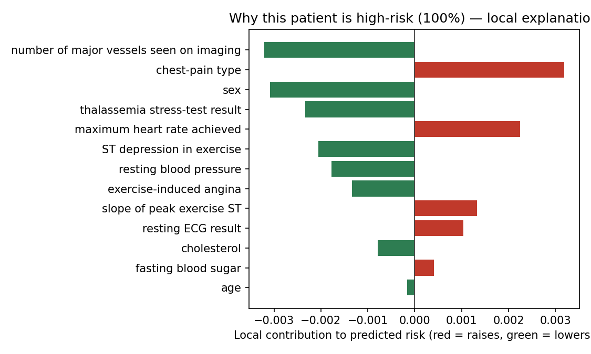

# Audience Health XAI

Plain-language explanations for healthcare risk predictions — my exploration of **audience-centred explainable AI**: the same prediction, explained differently for the people who read it.

## What it does

- Trains a random forest on structured cardiovascular-style tabular data (synthetic/public fallback)
- Computes SHAP contributions for an individual prediction
- Generates **two narrative formats**:
  - **Clinical** — feature-level contributions with cautious clinical framing
  - **Operational** — simplified language for care coordinators

## Run

```bash
python -m venv .venv && source .venv/bin/activate
pip install -r requirements.txt
python narrative_explainer.py
```

Output: `outputs/audience_narratives.txt`

## Data

Public/synthetic data only. No real patient records.

## References (APA)

- Miller, T. (2019). Explanation in artificial intelligence: Insights from the social sciences. *Artificial Intelligence, 267*, 1–38. https://doi.org/10.1016/j.artint.2018.07.007
- Lundberg, S. M., & Lee, S.-I. (2017). A unified approach to interpreting model predictions. *NeurIPS, 30*, 4765–4774. https://doi.org/10.48550/arXiv.1705.07874
- Ghassemi, M., Oakden-Rayner, L., & Beam, A. L. (2021). The false hope of current approaches to explainable AI in health care. *The Lancet Digital Health, 3*(11), e745–e750. https://doi.org/10.1016/S2589-7500(21)00208-9
- Tonekaboni, S., Joshi, S., McCradden, M. D., & Goldenberg, A. (2019). What clinicians want: Contextualizing explainable ML for clinical end use. *PMLR, 106*, 359–380. https://doi.org/10.48550/arXiv.1905.05134

*Audience-specific narratives draw on Miller's (2019) account of explanation as contrastive and social, and on what clinicians actually want (Tonekaboni et al., 2019). Ghassemi et al. (2021) caution that explanations must be validated for real clinical use — the question that motivates this project.*

## Results (reproducible — run `python narrative_results.py`)

Trained a logistic model on the real **UCI Heart Disease** dataset, took the
highest-risk patient, and rendered the *same* local explanation for two audiences.



**Clinical view:** "Model risk = 100%. Leading positive contributor: chest-pain
type. Mitigating: number of major vessels, sex, thalassemia result."

**Operational view:** "This patient is flagged HIGH risk (100%). The biggest
reason is chest-pain type, partly offset by imaging findings. Suggest clinical
review."

The full generated example is saved in `outputs_example.md`. The point of the
project: one model output, two faithful but audience-appropriate explanations.
