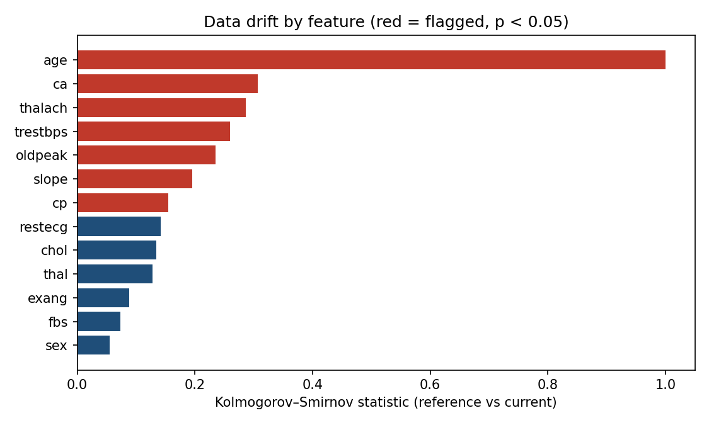

# health-data-quality-kit

Small Python utility for tabular data quality checks — the kind I used to run in industry before loading analytics tables.

Useful when working with healthcare-style datasets: missing values, duplicate rows, unexpected categories, basic distribution drift between train and test splits.

## Features

- Column-level null rate report  
- Duplicate row detection  
- Numeric range / outlier flags (IQR method)  
- Categorical cardinality warnings  
- Simple train vs test drift check (KS test for numeric columns)

## Usage

```bash
pip install -r requirements.txt
python -m health_dq.cli --input sample_data.csv --report outputs/dq_report.json
```

Or in Python:

```python
from health_dq.checks import run_quality_report
import pandas as pd

df = pd.read_csv("your_file.csv")
report = run_quality_report(df)
print(report["summary"])
```

## Sample data

`sample_data/patients_sample.csv` is fully synthetic — safe for demos and GitHub.

## Context

Data quality issues directly affect ML fairness and explanation trust. Connecting rigorous data-quality checks with explainable AI is a research thread I keep returning to.

## References (APA)

- Schelter, S., Lange, D., Schmidt, P., et al. (2018). Automating large-scale data quality verification. *Proceedings of the VLDB Endowment, 11*(12), 1781–1794. https://doi.org/10.14778/3229863.3229867
- Polyzotis, N., Roy, S., Whang, S. E., & Zinkevich, M. (2017). Data management challenges in production machine learning. *ACM SIGMOD*, 1723–1726. https://doi.org/10.1145/3035918.3054782
- Massey, F. J. (1951). The Kolmogorov-Smirnov test for goodness of fit. *Journal of the American Statistical Association, 46*(253), 68–78. https://doi.org/10.1080/01621459.1951.10500769

*The constraint-as-unit-test design follows Deequ (Schelter et al., 2018); the train/test drift check uses the Kolmogorov–Smirnov test (Massey, 1951).*

## Results (reproducible — run `python make_results.py`)

Quality report on the real **UCI Heart Disease** dataset (303 rows, 14 columns):
**1 duplicate row** and **75 rows** with IQR outliers were flagged. To exercise the
drift detector, the cohort is split into a younger 'reference' and an older
'current' batch, which induces a genuine shift; the KS-based check correctly flags
the affected features.



Flagged (p < 0.05): age, number of major vessels (ca), max heart rate (thalach),
resting BP (trestbps), ST depression (oldpeak), chest-pain type (cp), slope — every
feature that genuinely differs between younger and older patients, while stable
features are left unflagged.
