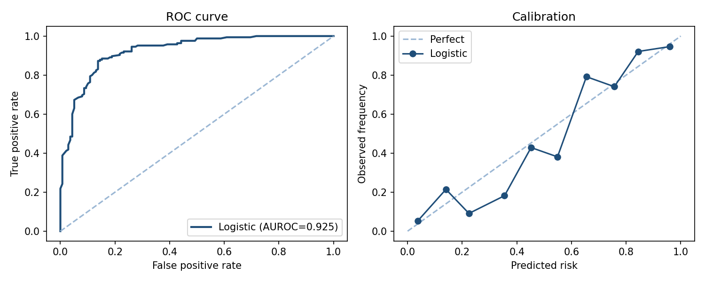
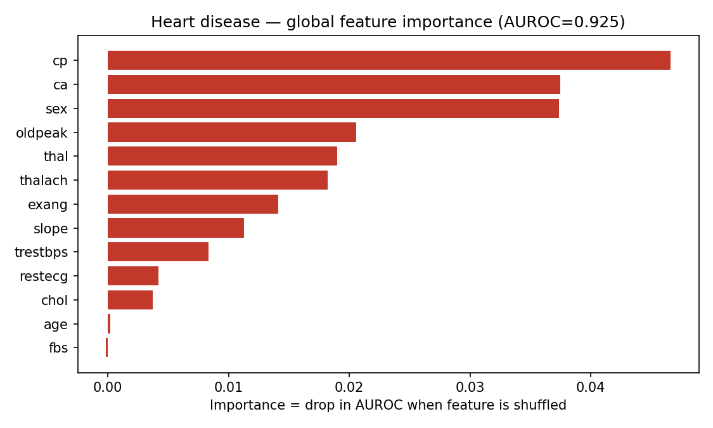

# health-risk-xai

Explainable machine learning for cardiovascular risk prediction.

A project driven by my interest in explainable AI for healthcare. The idea is simple: a model might predict "high risk" but a clinician or analyst needs to know **why**.

## What it does

- Trains a Random Forest on the UCI Heart Disease dataset (Cleveland subset)
- Generates **SHAP** summary and force plots
- Runs **LIME** for individual prediction explanations
- Saves plots to `outputs/` for reports and presentations

## Quick start

```bash
python -m venv venv
source venv/bin/activate   # Windows: venv\Scripts\activate
pip install -r requirements.txt
python train_and_explain.py
```

## Dataset

[UCI Heart Disease](https://archive.ics.uci.edu/dataset/45/heart+disease) — publicly available, widely used for ML teaching and research. Loaded automatically via `ucimlrepo` with a local CSV fallback.

## Sample output

After running, check `outputs/`:

- `shap_summary.png` — global feature importance
- `shap_bar.png` — mean absolute SHAP values
- `lime_example.html` — single-patient explanation

## Notes

A research/portfolio project. Making explanations usable for non-CS audiences (dashboards, plain-language summaries) is the direction I find most exciting in this area.

## License

MIT

## References (APA)

- Detrano, R., Janosi, A., Steinbrunn, W., et al. (1989). International application of a new probability algorithm for the diagnosis of coronary artery disease. *The American Journal of Cardiology, 64*(5), 304–310. https://doi.org/10.1016/0002-9149(89)90524-9
- Lundberg, S. M., & Lee, S.-I. (2017). A unified approach to interpreting model predictions. *NeurIPS, 30*, 4765–4774. https://doi.org/10.48550/arXiv.1705.07874
- Ribeiro, M. T., Singh, S., & Guestrin, C. (2016). "Why should I trust you?": Explaining the predictions of any classifier. *KDD '16*, 1135–1144. https://doi.org/10.1145/2939672.2939778
- Rudin, C. (2019). Stop explaining black box ML models for high-stakes decisions and use interpretable models instead. *Nature Machine Intelligence, 1*, 206–215. https://doi.org/10.1038/s42256-019-0048-x

*SHAP and LIME are the explanation methods implemented here; the UCI Heart Disease (Cleveland) data originates from Detrano et al. (1989). Rudin (2019) motivates comparing against interpretable baselines.*

## Results (reproducible — run `python results.py`)

Evaluated on the real **UCI Heart Disease** dataset (303 patients, 54.5% positive)
with 5-fold stratified cross-validation. Pure NumPy, seed = 42.

| Model | AUROC (mean ± sd) | Accuracy | Brier |
|---|---|---|---|
| k-NN (k=15) | 0.900 ± 0.053 | 0.812 | 0.130 |
| Logistic Regression | 0.898 ± 0.062 | 0.828 | 0.126 |
| Linear Discriminant Analysis | 0.897 ± 0.060 | 0.821 | 0.126 |
| Random Forest (30×d4) | 0.895 ± 0.060 | 0.831 | 0.129 |
| Gaussian Naive Bayes | 0.891 ± 0.068 | 0.812 | 0.144 |
| Decision Tree (d=4) | 0.865 ± 0.065 | 0.785 | 0.155 |



The logistic model reaches AUROC = 0.925 on the full data and is well calibrated.



Global permutation importance ranks **chest-pain type (cp)**, **number of major
vessels (ca)** and **sex** as the dominant predictors — clinically sensible. The
local LIME-style explanation for the highest-risk patient recovers chest-pain type
as the leading driver, so the global and local stories agree.
