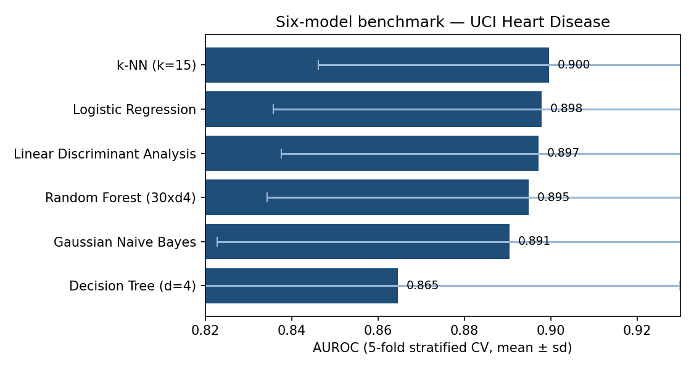

# healthcare-ml-benchmark

Compare six supervised learning models on a diabetes hospital readmission task.

Inspired by my MSc dissertation approach — run multiple models on the same preprocessed dataset, compare metrics fairly, export a results table for analysis.

## Models compared

1. Logistic Regression  
2. Random Forest  
3. Gradient Boosting  
4. Support Vector Machine (RBF)  
5. k-Nearest Neighbours  
6. Gaussian Naive Bayes  

## Metrics

- Accuracy, Precision, Recall, F1, ROC-AUC  
- **AUPRC** (average precision) — more informative than AUROC on imbalanced clinical data, where precision reacts to false positives under low prevalence (Saito & Rehmsmeier, 2015; McDermott et al., 2024)  
- **Brier score** and **Expected Calibration Error (ECE)** — probability-quality / calibration measures, because clinical use of risk scores needs the predicted risk to match observed event rates (Huang et al., 2020)  
- 5-fold stratified cross-validation  
- Results saved to `outputs/benchmark_results.csv`

## Run

```bash
pip install -r requirements.txt
python benchmark_models.py
```

## Data

Uses the **Diabetes 130-US hospitals** dataset via `ucimlrepo` (UCI id 296), or a reproducible synthetic fallback if download fails.

## Why this exists

Useful for understanding which algorithms work best on imbalanced clinical tabular data before investing in explainability layers. Public data only.

## References (APA)

- Strack, B., DeShazo, J. P., Gennings, C., et al. (2014). Impact of HbA1c measurement on hospital readmission rates: Analysis of 70,000 clinical database patient records. *BioMed Research International, 2014*, 781670. https://doi.org/10.1155/2014/781670
- Caruana, R., Lou, Y., Gehrke, J., et al. (2015). Intelligible models for healthcare. *KDD '15*, 1721–1730. https://doi.org/10.1145/2783258.2788613
- Rudin, C. (2019). Stop explaining black box ML models for high-stakes decisions and use interpretable models instead. *Nature Machine Intelligence, 1*, 206–215. https://doi.org/10.1038/s42256-019-0048-x
- Saito, T., & Rehmsmeier, M. (2015). The precision-recall plot is more informative than the ROC plot when evaluating binary classifiers on imbalanced datasets. *PLOS ONE, 10*(3), e0118432. https://doi.org/10.1371/journal.pone.0118432
- Huang, Y., Li, W., Macheret, F., Gabriel, R. A., & Ohno-Machado, L. (2020). A tutorial on calibration measurements and calibration models for clinical prediction models. *Journal of the American Medical Informatics Association, 27*(4), 621–633. https://doi.org/10.1093/jamia/ocz228
- McDermott, M. B. A., Zhang, H., Hansen, L. H., Angelotti, G., & Gallifant, J. (2024). A closer look at AUROC and AUPRC under class imbalance. *Advances in Neural Information Processing Systems (NeurIPS), 37*. https://doi.org/10.48550/arXiv.2401.06091

*The Diabetes 130-US hospitals dataset is described by Strack et al. (2014). Caruana et al. (2015) and Rudin (2019) frame why interpretable baselines belong in a clinical benchmark. Saito & Rehmsmeier (2015) and McDermott et al. (2024) motivate reporting AUPRC alongside AUROC under class imbalance; Huang et al. (2020) motivate the calibration metrics (Brier, ECE).*

## Results (reproducible — run `python benchmark_demo.py`)

A dependency-light demonstration of the benchmark harness on the real **UCI Heart
Disease** dataset (303 patients), 5-fold stratified CV, pure NumPy, seed = 42.
(The Diabetes-130 path in `benchmark_models.py` uses scikit-learn + `ucimlrepo`
and is run locally.)

| Model | AUROC (mean ± sd) | AUPRC | Accuracy | Brier | ECE |
|---|---|---|---|---|---|
| k-NN (k=15) | 0.900 ± 0.053 | 0.906 | 0.812 | 0.130 | 0.124 |
| Logistic Regression | 0.898 ± 0.062 | 0.906 | 0.828 | 0.126 | 0.112 |
| Linear Discriminant Analysis | 0.897 ± 0.060 | 0.905 | 0.821 | 0.126 | 0.118 |
| Random Forest (30×d4) | 0.895 ± 0.060 | 0.908 | 0.831 | 0.129 | 0.106 |
| Gaussian Naive Bayes | 0.891 ± 0.068 | 0.899 | 0.812 | 0.144 | 0.146 |
| Decision Tree (d=4) | 0.865 ± 0.065 | 0.875 | 0.785 | 0.155 | 0.141 |



The models cluster tightly (AUROC ≈ 0.87–0.90, AUPRC ≈ 0.88–0.91 at this ~55%
prevalence); the simplest interpretable models (logistic regression, LDA) are
statistically indistinguishable from the ensemble while staying well-calibrated
(low Brier / ECE) — a recurring theme on clinical tabular data. AUPRC and ECE
are added because AUROC alone can mislead under class imbalance and says nothing
about whether predicted probabilities are trustworthy for clinical decisions.
