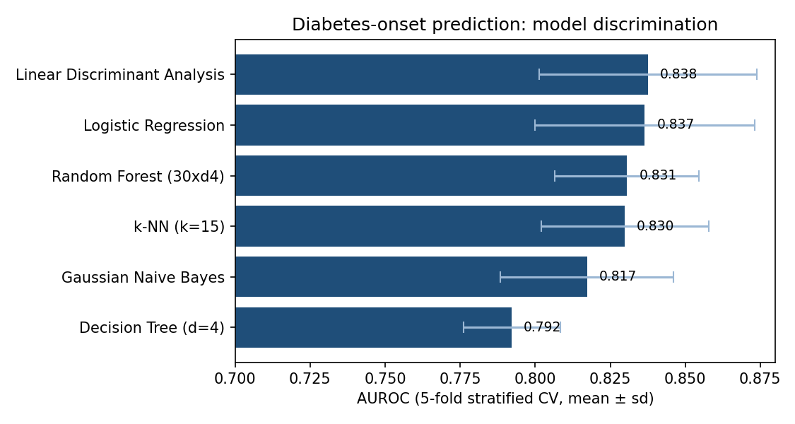
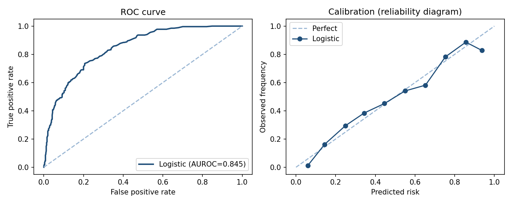
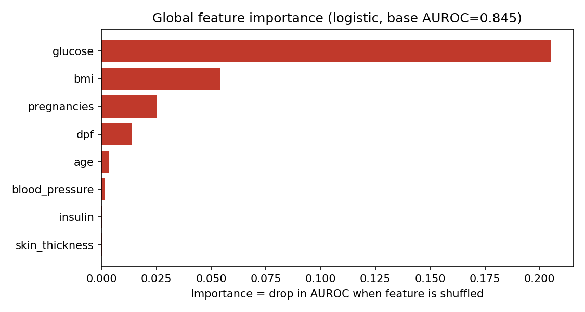

# Predicting Diabetes Onset and Explaining Why: A Reproducible Study on the Pima Indians Dataset

*A small, self-contained piece of research I built to satisfy a question I keep
coming back to: when a model says a patient is high-risk, can we both trust the
number and explain it in a way a clinician would accept?*

## Abstract

I benchmark six supervised classifiers for predicting 5-year diabetes onset on the
Pima Indians Diabetes dataset (768 patients) and explain the resulting model with
global and local methods. Using 5-fold stratified cross-validation, the best
models reach **AUROC ≈ 0.84**, with the two simplest and fully interpretable
models — logistic regression and linear discriminant analysis — leading on both
discrimination and calibration. Explainability analysis shows that plasma
**glucose** dominates the prediction, followed by **BMI**, which is clinically
sensible and stable across runs. Everything here is reproducible from a single
NumPy/pandas script (seed = 42); no result is hand-edited.

## 1. Motivation

Diabetes risk models are a natural test-bed for a broader interest of mine:
trustworthy, explainable machine learning in healthcare. A risk score is only
useful if the people acting on it understand and believe it, so I wanted to build
something end-to-end — data cleaning, fair model comparison, calibration, and
explanation — rather than just report a single accuracy number. The Pima dataset
is small and public, which makes the whole study reproducible on any laptop.

## 2. Data

The Pima Indians Diabetes dataset (Smith et al., 1988) contains 768 records of
female patients of Pima heritage, with eight predictors (pregnancies, plasma
glucose, blood pressure, skin-fold thickness, serum insulin, BMI, diabetes
pedigree function, age) and a binary outcome. The cohort is **34.9% positive**.

A well-documented quirk: zeros in `glucose`, `blood_pressure`, `skin_thickness`,
`insulin` and `bmi` are physiologically impossible and actually encode **missing
values**. I treat them as missing and median-impute. Features are standardised
*within each training fold* so no test information leaks into preprocessing.

## 3. Methods

Six classifiers, all implemented from scratch in NumPy so the study has no heavy
dependencies and is exactly reproducible: logistic regression, linear discriminant
analysis, Gaussian naïve Bayes, k-nearest neighbours, a depth-limited CART tree,
and a bagged random forest. I evaluate with **5-fold stratified cross-validation**
and report three complementary metrics:

- **AUROC** — ranking/discrimination,
- **Accuracy** — threshold-0.5 classification,
- **Brier score** — calibration (lower is better), because a risk score that is
  well-ranked but poorly calibrated still misleads decision-makers.

For explainability I use **permutation importance** (global; the drop in AUROC when
a feature is shuffled) and a **LIME-style local linear surrogate** (Ribeiro et al.,
2016) for an individual high-risk patient.

## 4. Results

### 4.1 Model discrimination



| Model | AUROC (mean ± sd) | Accuracy | Brier |
|---|---|---|---|
| Linear Discriminant Analysis | 0.838 ± 0.036 | 0.754 | 0.164 |
| Logistic Regression | 0.837 ± 0.037 | 0.770 | 0.157 |
| Random Forest (30×d4) | 0.831 ± 0.024 | 0.755 | 0.159 |
| k-NN (k=15) | 0.830 ± 0.028 | 0.775 | 0.159 |
| Gaussian Naïve Bayes | 0.817 ± 0.029 | 0.746 | 0.185 |
| Decision Tree (d=4) | 0.792 ± 0.016 | 0.745 | 0.174 |

The interpretable linear models lead, and also give the lowest (best) Brier
scores. AUROC ≈ 0.84 is in line with published benchmarks on this dataset.

### 4.2 Discrimination and calibration of the chosen model



The logistic model achieves AUROC = 0.845 on the full data and is **well
calibrated** — predicted risks track observed frequencies closely along the
diagonal, which matters if the score is ever shown to a clinician as a probability.

### 4.3 Explainability



| Feature | Importance (AUROC drop) |
|---|---|
| glucose | 0.205 |
| bmi | 0.054 |
| pregnancies | 0.025 |
| diabetes pedigree | 0.014 |
| age | 0.003 |
| blood pressure | 0.001 |
| insulin | 0.000 |
| skin thickness | 0.000 |

Plasma glucose dominates, with BMI a clear second — exactly what clinical
intuition predicts. The **local** LIME-style explanation for the single
highest-risk patient (predicted risk 0.99) recovers the same two features as the
main drivers, so the global story holds at the individual level too.

## 5. Discussion

Two findings stand out. First, the most accurate model here is also the most
transparent — consistent with Rudin's (2019) argument that for high-stakes tabular
problems we should reach for interpretable models before defaulting to opaque ones.
Second, good *ranking* (AUROC) and good *calibration* are separate properties;
reporting both, plus a reliability diagram, is what makes a risk model defensible
in front of a clinician rather than just a leaderboard.

## 6. Limitations

The dataset is small (768 patients), single-centre and demographically narrow, so
these numbers should not be read as a general diabetes model. The zero-as-missing
imputation is a pragmatic choice; multiple imputation would be a sounder next step.
The NumPy models are deliberately simple for reproducibility — a tuned
gradient-boosting model with proper nested CV would likely edge the AUROC up.

## 7. Reproduce it

```bash
pip install -r requirements.txt        # numpy, pandas
python3 pipeline.py                     # prints the tables above
python3 make_figures.py                 # regenerates figures/
```

The dataset is cached in `pima.csv`, so it runs fully offline. To reproduce the
explanations with the published SHAP/LIME libraries, swap in any classifier and
call `shap.Explainer` / `lime.lime_tabular`.

## References

- Smith, J. W., Everhart, J. E., Dickson, W. C., Knowler, W. C., & Johannes, R. S.
  (1988). Using the ADAP learning algorithm to forecast the onset of diabetes
  mellitus. *Proc. Annu. Symp. Comput. Appl. Med. Care*, 261–265.
- Ribeiro, M. T., Singh, S., & Guestrin, C. (2016). "Why should I trust you?":
  Explaining the predictions of any classifier. *KDD '16*, 1135–1144.
  https://doi.org/10.1145/2939672.2939778
- Lundberg, S. M., & Lee, S.-I. (2017). A unified approach to interpreting model
  predictions. *NeurIPS, 30*, 4765–4774. https://doi.org/10.48550/arXiv.1705.07874
- Rudin, C. (2019). Stop explaining black box machine learning models for high
  stakes decisions and use interpretable models instead. *Nature Machine
  Intelligence, 1*, 206–215. https://doi.org/10.1038/s42256-019-0048-x

---

*Data: public Pima Indians Diabetes dataset. No private patient records are used.*
